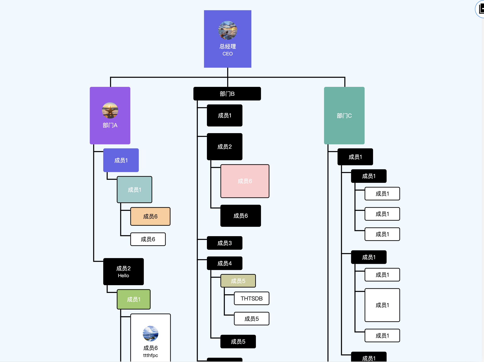

# tree-graph

早期接单开发纵横结合树型图，（并没单独抽离组件，而且纵横向结合也是固定的）
因此我再后续单独开个项目写一份组件化的高度自定义树型图

## Project Setup

```sh
npm install
```

### Compile and Hot-Reload for Development

```sh
npm run dev
```

### Compile and Minify for Production

```sh
npm run build
```

## Example
演示地址：https://www.bilibili.com/video/BV18z4y137Nv/?spm_id_from=333.999.0.0&vd_source=409a76ad81e6b342b8027e8bfdbd31d4

---

